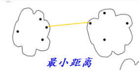
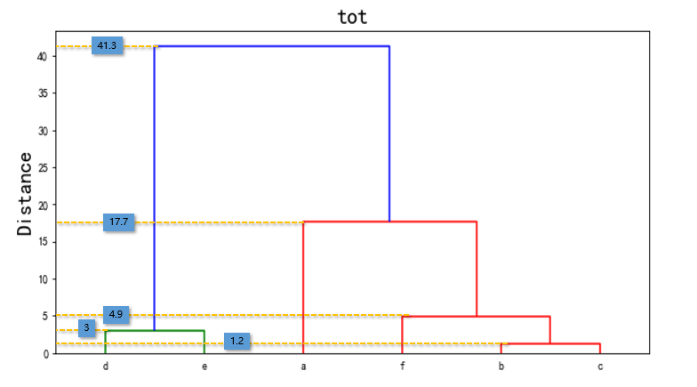

## 层次聚类

本文档只简单介绍了一下计算类与类之间的方法。


### 一、原理及方法

#### 1、层次法

先计算样本之间的距离，每次将距离最近的点合并到同一个类；然后，再计算类与类之间的距离，将距离最近的类合并为一个大类。

#### 2、计算类与类之间的方法

（1）最短距离法（single）：将类与类的距离定义为类与类之间样本的最短距离；
$$
d(u,v) = min(dist(u[i],v[j])
$$
其中：u，v为类；i为u类中的点；j为v类中的点。




（2）最长距离法（complete）：将类与类的距离定义为类与类之间样本的最长距离；
$$
d(u,v) = max(dist(u[i],v[j])
$$
其中：u，v为类；i为u类中的点；j为v类中的点。


（3）均值距离法（average）:  计算两个组合数据点中的每个数据点与其他所有数据点的距离，将所有距离的均值作为两个组合数据点间的距离（非加权）；
$$
d(u,v) = \sum_{ij} \frac{d(u[i],v[j])}{(|u|*|v|)}
$$
其中：|u|，|v|是聚类u和v中元素的的个数。


（4）weighted距离法：难以用图和文字说明，直接看公式吧，它和均值距离法得区别可参见下面实际应用中得例子；
$$
d(u,v) = (dist(s,v) + dist(t,v))/2
$$
其中：u是由s和t形成的，而v是森林中剩余的聚类簇，这被称为WPGMA（加权分组平均）法。

 （5）ward方法（沃德方差最小化算法）


- 具体解释如下（摘自[CSDN](https://blog.csdn.net/waltertan1988/article/details/73250691)）：

Ⅰ输入距离矩阵，初始化每一个点为cluster，此时每个组内的ESS为０，ESS公式如下：
$$
ESS = \sum_{ij}^ｎx_ｉ^2－\frac{１}{ｎ}\left(\sum_{ij}^ｎx_ｉ^2\right)^2
＝nVar(X)=nE[(X-E(X))^2]
$$
Ⅱ 计算合个cluster的成本：

```
cost = ESS（总-合并后）-ESS（总-合并前）
ESS（总-合并前）=ESS（红）+ESS（黄）+ESS（其他没画出来的组）
ESS（总-合并后）=ESS（红黄）+ESS（其他没画出来的组）
```

画的那个树状图的高度，可以认为是上面说的这个“成本”。

- 其中在`python scipy.cluster.hierarchy`算法中用到的目标函数如下（虽然我能理解上面说的成本，但是对于具体算法中用的这：

$$
d(u,v) = \sqrt{\frac{|v|+|s|}{T}{d(v,s)^2}+\frac{|v|+|t|}{T}{d(v,t)^2}-\frac{|v|}{T}{d(s,t)^2}}
$$
u是s和t组成的新的聚类，v是森林中未使用的聚类。T = |v|+|s|+|t|，|*|是聚类簇中观测值的个数。在下一章节中会有具体的例子来说明这一公式。


### 二、实际应用

假设一样本数据（距离矩阵）如下，根据不同计算距离的方法画出层次聚类图：


#### 1、最短距离法

（1）两两之间b与c之间的距离最小，先聚合b和c，并重新计算距离距离、更新矩阵：

```
例如层u(b,c)与a的距离为：
d(u(b,c),a)=min(d(b,a),d(c,a))=min(21.6,22.6)=21.6
```


（2）基于新的距离矩阵，d和e之间的距离最小，聚合d和e，再次更新距离矩阵；

（3）重复以上步骤，知道所有的样本都在一个类中，最后画出层次聚类图。



#### 2、均值距离法

（1）两两之间b与c之间的距离最小，先聚合b和c，并重新计算距离距离、更新矩阵：

```
例如在第三次更新距离矩阵时层u(b,c,f)与a的距离为：
d(u(b,c,f),a)=sum(d(b,a),d(c,a),d(f,a))/3=(21.6+22.6+17.7)=20.633
```


（2）基于新的距离矩阵，d和e之间的距离最小，聚合d和e，再次更新距离矩阵；

（3）重复以上步骤，知道所有的样本都在一个类中，最后画出层次聚类图。


#### 3、weighted距离法

步骤均与以上两种方法相同。通过相同的例子来说明和均值距离法得差别：

```
例如在第三次更新距离矩阵时层u(b,c,f)与a的距离为【采用第二次更新后的矩阵】：
d(u(b,c,f),a)=sum(d(u(b,c),f),d(f,a))/2=(21.1+17.7)=19.9
```


#### 4、ward距离法

下面以第三次更新矩阵后为例，计算层`u(d,e)`与`u(b,c,f)`之间的距离：

```
- 根据公式中提到的u是s和t组成的新的聚类，v是森林中未使用的聚类。
- 在该例中新的聚类u极为u(b,c,f),s为u(b,c),v为f。
- T = |v|+|s|+|t|=2+1+2=5
```

因此公式为：
$$
d(u(b,c,f),u(b,c)) = \sqrt{\frac{4}{5}{d(u(b,c),u(d,e))^2}+\frac{3}{5}{d(f,u(d,e))^2}-\frac{2}{5}{d(f,u(b,c))^2}} = \sqrt{\frac{4}{5}{59.93^2}+\frac{3}{5}{54.0^2}-\frac{2}{5}{9.07^2}}=67.76
$$


